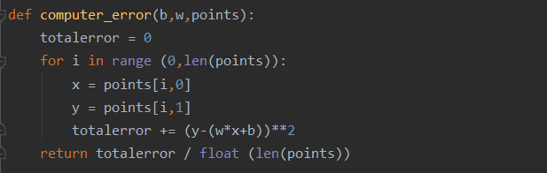
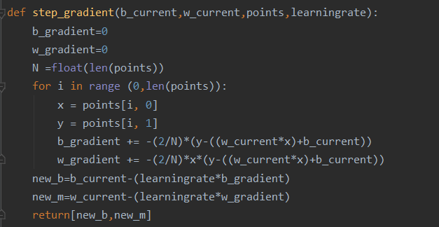
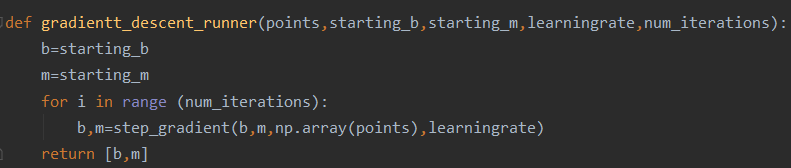
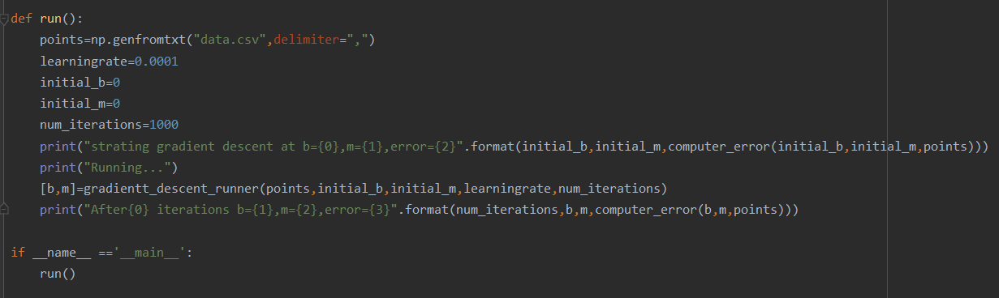
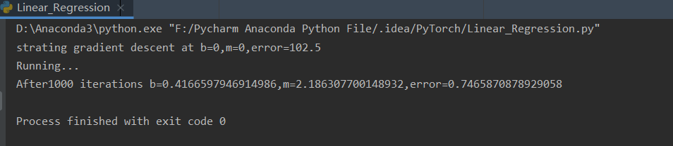

# Linear Regression初探

eg loss=x^2*sin(x)

高中求极值：求导数，找导数为0 点，判断是否为极大值或极小值

梯度下降法：X'=X-δX（Y在X处的导数） 每一步迭代

### Linear Regression实现

learning rate学习速率X'=X-lr*δX(lr is short for learning rate)

### 求解Linear Regression

#### comput_error

#### step_gradient

#### gradient_descent_runner

#### run

#### 输出

